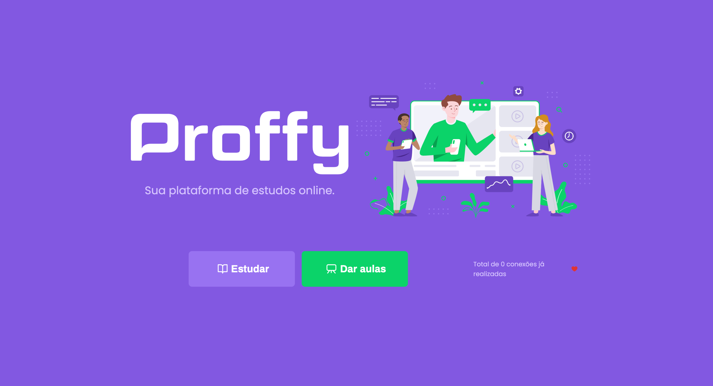
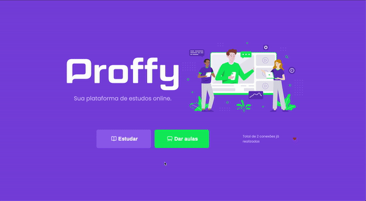

<div align="center">
  
</div>

<p align="center">
  <a href="#layout">Layout</a>
  &nbsp;&nbsp;&nbsp;|&nbsp;&nbsp;&nbsp;
  <a href="#about">About</a>
   &nbsp;&nbsp;&nbsp;|&nbsp;&nbsp;&nbsp;
  <a href="#features">Features</a>
  &nbsp;&nbsp;&nbsp;|&nbsp;&nbsp;&nbsp;
  <a href="#run">Run</a>
  &nbsp;&nbsp;&nbsp;|&nbsp;&nbsp;&nbsp;
  <a href="#license">License</a>
</p>

## Layout

<div align="center">
  
    &nbsp;&nbsp;&nbsp;
   
</div>

<div align="center">

</div>

## About

Project created from Next Level Week, offered by [Rocketseat](https://rocketseat.com.br/). The idea of the project is to connect people who want to learn from those who want to teach, from an online platform. It is possible to find teachers available for the subjects available in the system.

## Features

### Connections

- **`List the number of connections already made`**
- **`Create a new connection`**

### Classes

- **`Create a class`**
- **`List classes`**
  - **`Filter by subject`**
  - **`Filter by week day`**
  - **`Filter by time`**

## Run

### Clone the repository

```bash
# Clone Repository
$ git clone https://github.com/ianbandrade/PROFFY_Project.git
```

### Run the server API

```bash
# Go to server folder
$ cd PROFFY_Project/server

# Install Dependencies
$ yarn install

# Run Aplication
$ yarn start
```

Access API at http://localhost:3333/

### Run web

```bash
# Go to web folder
$ cd PROFFY_Project/webs

# Install Dependencies
$ yarn install

# Run Aplication
$ yarn start
```

Go to http://localhost:3000/ to see the result.

## License

This project is under the MIT license. See the file [LICENSE](LICENSE) for more details.
